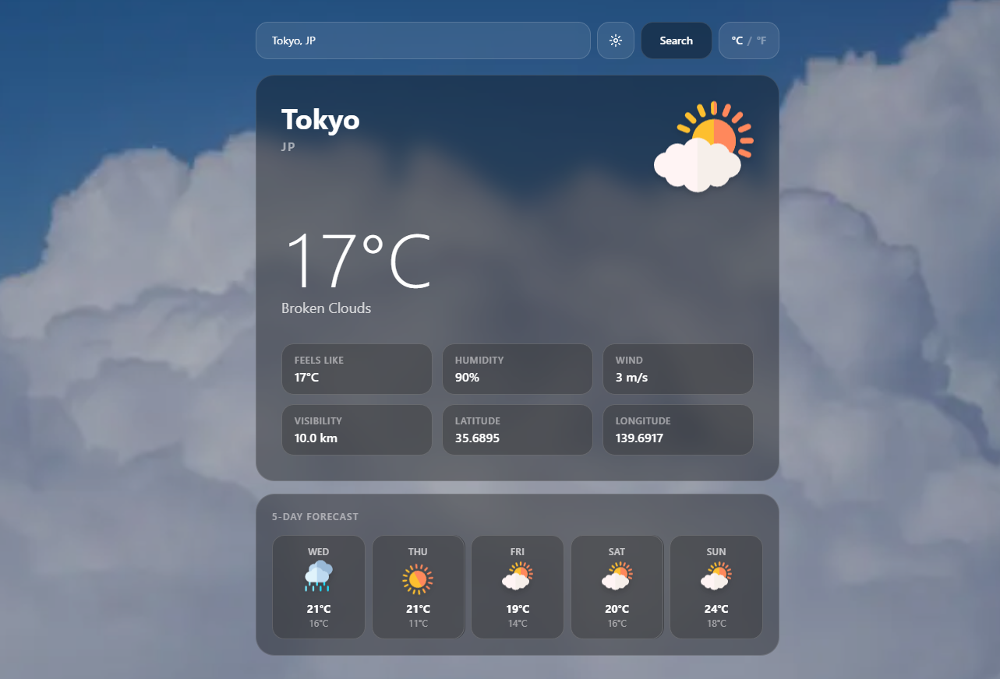

# Weather App



A real-time weather application built with **SvelteKit**, **TypeScript**, and **Tailwind CSS v4**. Search any city in the world and get live conditions, a 5-day forecast, and a dynamic background that changes with the weather.

## Features

- **Live weather data** — current temperature, feels like, humidity, wind speed, visibility, and coordinates
- **5-day forecast** — daily high/low temperatures with weather icons
- **Dynamic backgrounds** — full-screen background image that crossfades to match the current weather condition
- **Geolocation** — one-click weather for your current location
- **Unit toggle** — switch between °C and °F, persisted across sessions
- **Secure API** — API key never exposed to the client; all OWM requests proxied through SvelteKit server routes
- **Custom loading** — animated loader component while fetching
- **Error handling** — auto-dismiss error banner for API and network failures

## Tech Stack

| Layer | Technology |
|---|---|
| Framework | [SvelteKit 2](https://kit.svelte.dev) + Svelte 5 (Runes) |
| Language | TypeScript |
| Styling | Tailwind CSS v4 |
| Deployment | Vercel (`@sveltejs/adapter-vercel`) |
| Weather API | [OpenWeatherMap](https://openweathermap.org/api) |

## Project Structure

```
src/
├── lib/
│   ├── components/
│   │   ├── SearchBar.svelte       # City search input + geolocation button
│   │   ├── UnitToggle.svelte      # °C / °F toggle
│   │   ├── WeatherCard.svelte     # Main weather display card
│   │   ├── WeatherIcon.svelte     # Animated condition icon
│   │   ├── FeatureGrid.svelte     # Feels like, humidity, wind, visibility, coords
│   │   ├── ForecastStrip.svelte   # 5-day forecast row
│   │   ├── LoadingOverlay.svelte  # Custom animated loader
│   │   └── ErrorBanner.svelte     # Auto-dismiss error toast
│   ├── stores/
│   │   └── settings.svelte.ts     # Unit preference (localStorage)
│   ├── types/
│   │   └── weather.ts             # TypeScript interfaces
│   └── utils/
│       ├── weatherMapping.ts      # OWM ID → condition, icon, background
│       └── formatters.ts          # Temperature, wind, visibility, date
├── routes/
│   ├── api/
│   │   ├── weather/+server.ts     # Server-side OWM current weather proxy
│   │   └── forecast/+server.ts   # Server-side OWM 5-day forecast proxy
│   ├── +layout.svelte
│   └── +page.svelte
static/
├── icons/                         # SVG weather condition icons (7 files)
├── backgrounds/                   # Dynamic background images (7 .webp files)
└── fonts/
```

## Getting Started

### Prerequisites

- Node.js 18+
- An [OpenWeatherMap API key](https://openweathermap.org/api) (free tier works)

### Installation

```bash
git clone https://github.com/aozoragh/Weather-website
cd Weather-website
npm install
```

### Environment Variables

Create a `.env` file in the project root:

```env
OPENWEATHER_API_KEY=your_api_key_here
```

### Background Images

Place 7 `.webp` background images in `static/backgrounds/`, named exactly:

```
clear.webp       clouds.webp      rain.webp
drizzle.webp     storm.webp       snow.webp
atmosphere.webp
```

### Development

```bash
npm run dev
```

The dev server runs on `http://localhost:5173` and is also accessible over LAN/VPN via your machine's IP on the same port.

### Build & Type Check

```bash
npm run check   # TypeScript + Svelte type checking
npm run build   # Production build
```

## Deployment (Vercel)

1. Push to GitHub
2. Import the repository on [vercel.com](https://vercel.com)
3. Add `OPENWEATHER_API_KEY` under **Settings → Environment Variables**
4. Deploy — Vercel handles the rest

> The `npm run build` symlink error on Windows is a known local limitation of `adapter-vercel`. It does not affect Vercel's CI/CD (which runs on Linux).

## API Routes

All weather data is fetched server-side to keep the API key out of the browser.

| Route | Parameters | Description |
|---|---|---|
| `GET /api/weather` | `q` or `lat`+`lon` | Current weather for a city or coordinate |
| `GET /api/forecast` | `q` or `lat`+`lon` | 5-day forecast, aggregated to daily summaries |

Data is always fetched in metric (°C) and converted client-side based on the user's unit preference.

## License

MIT
